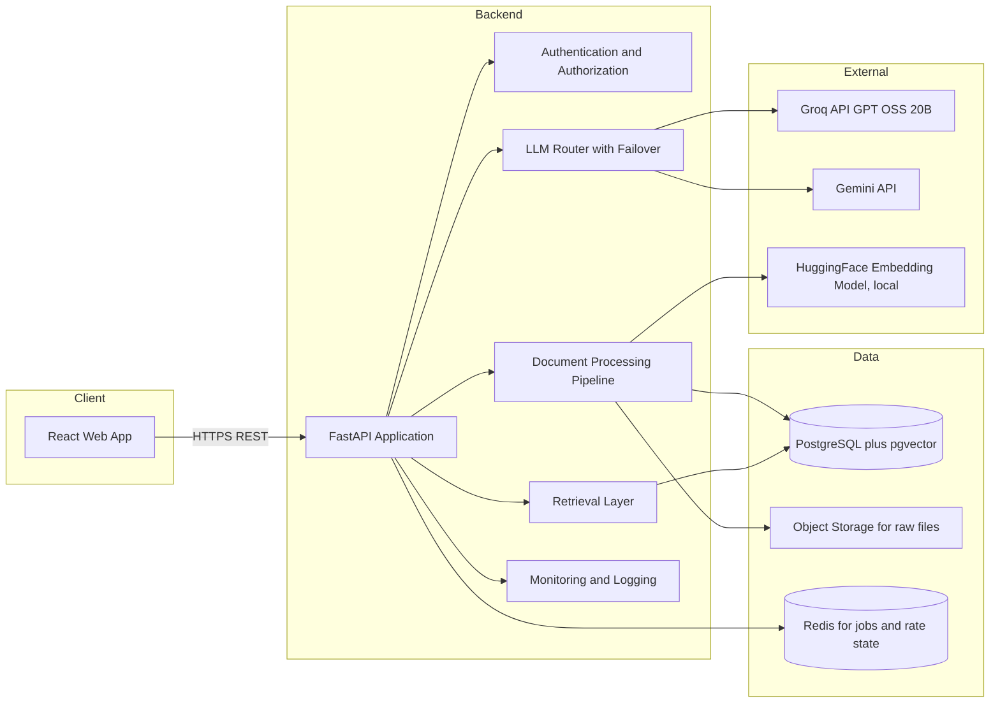
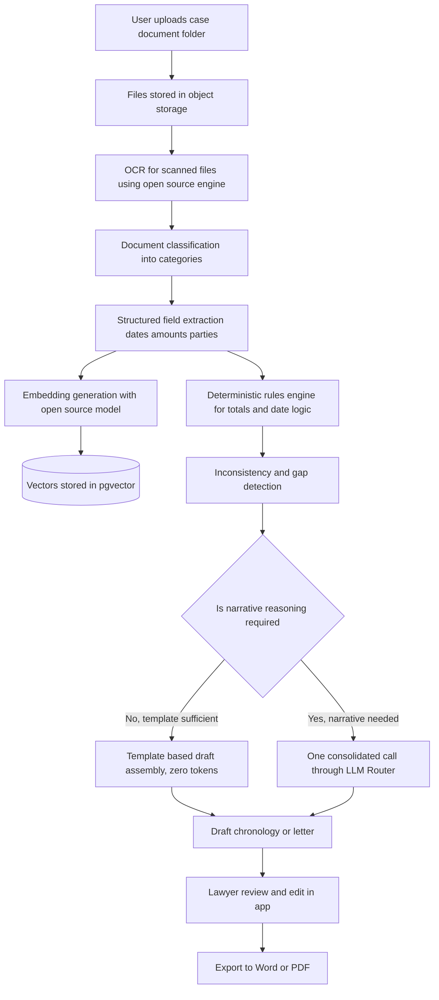
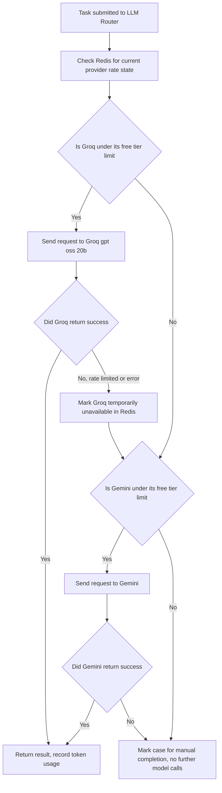
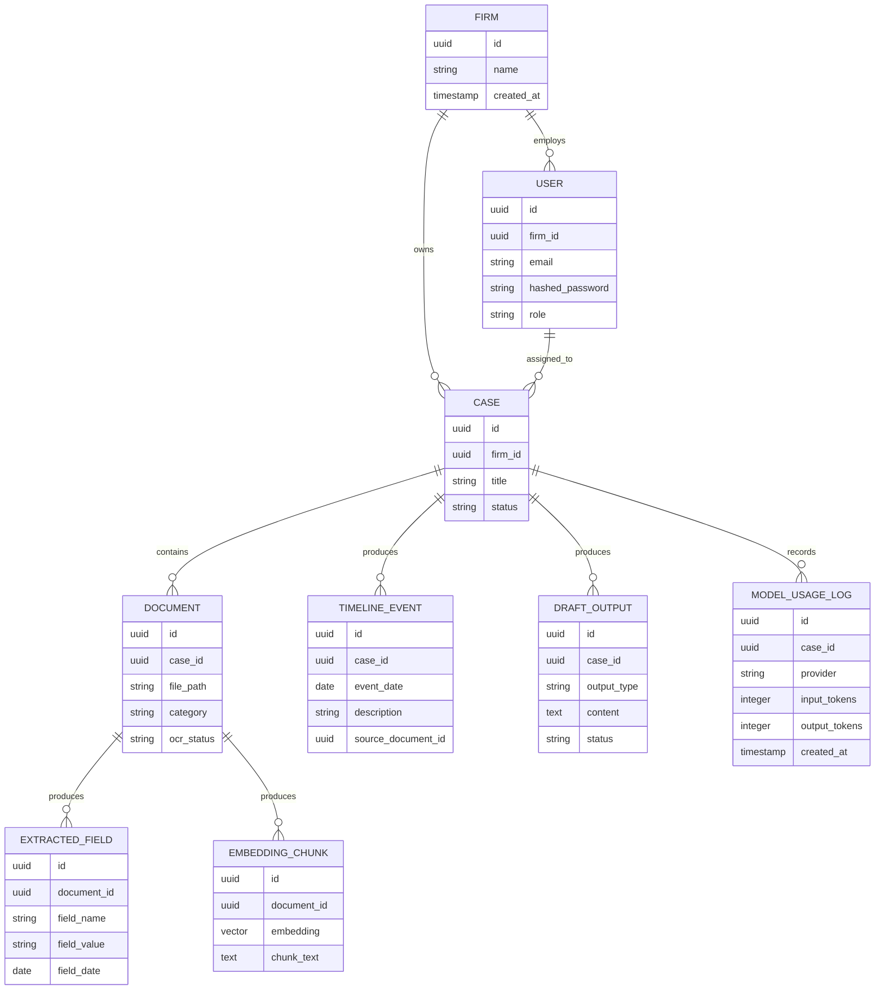

# Legal Documentation Automation Platform
## End to End Project Plan

Version 2.0
Status Revised for production grade development

---

## 1. Project Overview

This project builds a production grade software as a service application that automates the daily documentation workload of law firms and lawyers. The application ingests raw case documents such as medical records, bills, wage reports, contracts, correspondence, and court filings, whether digital or scanned, and produces structured outputs that a lawyer or paralegal currently produces by hand. These outputs include classified document sets, chronological timelines, damages calculations, inconsistency flags, and first draft demand letters or case summaries.

The system consists of a public marketing website built to the visual and content standard of a large, established enterprise software company, a secure authenticated application, and a backend architecture that is scalable, observable, and safe for multiple firms to use at once, while relying only on free and open source technology for the current stage.

### 1.1 Goals

- Reduce the manual hours lawyers and paralegals spend on document sorting, timeline building, and first draft generation.
- Provide analytical value beyond simple search or chat, such as damage calculation, deadline extraction, and inconsistency detection across documents.
- Operate on a minimal large language model token budget per case, by using retrieval, structured extraction, and open source embeddings before invoking a large language model, and by invoking a large language model only once per case for the final reasoning and drafting step.
- Present a professional, trustworthy public interface comparable to a Fortune 100 software company website, so the product can be shown confidently to law firms during a sales conversation.
- Use only freely available technology for the minimum viable product, so the system can be built, tested, and demonstrated at zero infrastructure cost.
- Follow production grade software engineering practice from the first commit, including automated testing, continuous integration, environment separation, and monitoring, so the minimum viable product can graduate into a real deployment without a rewrite.

### 1.2 Non Goals for the Minimum Viable Product

- Full contract lifecycle management.
- Court electronic filing integrations.
- Billing and time tracking.
- Multi firm enterprise administration features beyond basic firm and user management.
- Real time collaborative document editing.

---

## 2. Problem Statement

Lawyers and paralegals routinely receive large, unorganized sets of case documents. Building a usable case record from this material today requires manually reading every file, extracting relevant facts and dates, cross checking figures such as medical bills or wage loss against supporting records, and then assembling a written work product such as a demand letter or case chronology. This work is repetitive, time consuming, and error prone, yet it does not require legal judgment to perform the extraction and organization steps.

Existing large legal artificial intelligence platforms such as Harvey and Legora target large enterprise law firms with broad, expensive, sales led platforms. Mid sized firms and solo practitioners are underserved because they lack the budget and procurement process for these platforms, and because most affordable available tools are limited to plain document chat rather than structured analytical output.

The opportunity is to build a focused, affordable, professionally engineered tool that takes a folder of case documents and returns an organized chronology, a damages estimate, a list of inconsistencies or gaps, and a drafted letter, with minimal manual effort, minimal artificial intelligence cost per case, and a level of engineering discipline that supports real production use rather than a fragile prototype.

---

## 3. Users and Roles

- **Lawyer** reviews and edits generated drafts, approves final output, manages case level settings.
- **Paralegal or Case Manager** uploads documents, triggers processing, reviews extracted data before it reaches the lawyer.
- **Firm Administrator** manages users, firm level settings, and usage reporting.
- **System Administrator**, an internal role, manages the platform, model configuration, and monitoring across all firms.

Role based access control governs which actions each role can perform within a firm account, and firm level data isolation, enforced at the database query layer, ensures one firm can never see another firm's cases.

---

## 4. High Level Architecture



---

## 5. End to End Workflow



The design principle behind this flow is that the large language model is only called once per case, at the end of the pipeline, with a condensed, pre structured input built from deterministic extraction and rules rather than raw document text. This is the primary control for minimizing token usage, described fully in Section 10.

---

## 6. Feature Scope for the Minimum Viable Product

1. **Document Intake and Classification.** Upload a folder or archive of files. Each file is passed through optical character recognition if scanned, then classified into categories such as medical record, bill, wage record, correspondence, contract, or filing.
2. **Structured Extraction.** For each classified document, extract key fields relevant to its category, such as dates of service, provider names, billed amounts, wage figures, contract parties, and clause terms.
3. **Chronology Builder.** Combine extracted events across all documents into a single, ordered timeline with source references back to the originating document and page.
4. **Damages and Totals Calculation.** Deterministically sum billed amounts and wage loss figures extracted from documents, without relying on the large language model for arithmetic.
5. **Inconsistency and Gap Detection.** Compare extracted fields across documents to flag mismatched dates, missing follow up records, or figures that do not reconcile, using rule based comparison first and model assistance only for genuinely ambiguous cases.
6. **Draft Generation.** Assemble a first draft summary or demand letter from the chronology and totals using a template, with the model used only to write connecting narrative language.
7. **Review and Export.** Lawyer reviews the draft inside the application, edits inline, and exports to Word or PDF.
8. **Authentication, Roles, and Case Management.** Secure login, firm level data isolation, and a case dashboard.

Deferred to later phases: legal research, contract playbook comparison, litigation document review at scale, and outcome prediction or benchmarking against historical case data.

---

## 7. Technology Stack

All components below are free to use for development and demonstration.

| Layer | Technology | Notes |
|---|---|---|
| Frontend | React with TypeScript | Component based, used for both the marketing site and the authenticated app |
| Frontend styling | Tailwind CSS with a defined design token set | Utility first styling for a consistent, enterprise grade visual system |
| Frontend charts | Open source charting library such as Recharts | For the chronology timeline visual and damages summary panels |
| Backend framework | FastAPI, Python | Async, typed, automatic OpenAPI documentation |
| Authentication | OAuth2 password flow with JSON Web Tokens, access token and refresh token pair, password hashing through passlib with bcrypt | Free, no third party identity service required |
| Authorization | Role based access control in the backend, firm scoped filters enforced on every query | Prevents cross firm data access even if an identifier is guessed |
| Database | PostgreSQL | Free, open source, relational, supports row level security |
| Vector storage | pgvector extension on PostgreSQL | Keeps relational and vector data in one system, avoids operating a second database |
| Job queue and rate state | Redis with Celery, or FastAPI background tasks for the earliest milestone | Handles asynchronous processing and tracks provider rate limit state |
| Optical character recognition | Tesseract OCR through pytesseract, or the open source EasyOCR library | Free, local processing of scanned documents |
| Document parsing | PyMuPDF for PDF, python docx for Word files | Free libraries for extracting text and structure |
| Embeddings | Open source HuggingFace sentence embedding model, for example sentence transformers all MiniLM L6 v2 or BAAI bge small en v1.5 | Runs locally, no per call cost, adequate quality for retrieval |
| Primary language model | Groq API, model identifier openai gpt oss 20b | Free tier, very high throughput, used for structured extraction style tasks and quick drafting |
| Secondary language model | Gemini API, current free tier flash class model | Used when Groq free tier limits are reached, and for tasks needing a longer context window, exact current model identifier to be confirmed in Google AI Studio at build time since free tier model names change over time |
| Containerization | Docker and Docker Compose | Consistent local development, and the basis for later deployment |
| Continuous integration | GitHub Actions, free for public and limited private use | Runs automated tests and linting on every pull request |
| Version control | Git and GitHub | Source control, see Section 15 for commit discipline |
| Documentation | Markdown with Mermaid diagrams, rendered through MkDocs with the Material theme | Free, produces a clean, professional documentation site |
| Monitoring and logging | Structured logging through the Python logging module, exported to an open source stack such as Grafana and Loki, or a simpler file based log for the earliest milestone | Free, upgrades in place as the system grows |

---

## 8. Repository Structure

```
legal-doc-platform/
  backend/
    app/
      api/            REST route definitions grouped by resource
      core/           configuration, security, and settings
      models/         SQLAlchemy models
      schemas/        Pydantic request and response schemas
      services/       extraction, classification, chronology, draft logic
      llm/            provider clients and the LLM router
      workers/        background job definitions
      tests/          unit and integration tests
    alembic/          database migrations
    Dockerfile
  frontend/
    src/
      pages/          marketing site pages and app pages
      components/     shared design system components
      features/       feature specific components, for example chronology view
      lib/            API client and utilities
      styles/         design tokens and Tailwind configuration
    public/
    Dockerfile
  docs/
    mkdocs.yml
    architecture/      including data-sources.md, the sample-data sourcing and labeling policy
    setup/
    user-guide/
  data/
    sample_case_folder/   assembled real sample documents, see Section 11; data only, no documentation files
  docker-compose.yml
  .github/
    workflows/
```

This structure separates concerns cleanly, keeps the language model logic isolated inside a single module for easier testing and swapping, and keeps documentation and sample data inside the repository so the whole project is reproducible from a fresh clone.

Documentation lives in exactly two places, each with a distinct audience: a short `README.md` inside each backend package and frontend folder (Section 19) explains that module's purpose to someone browsing the code directly, while `docs/` (rendered through MkDocs) is the narrative, architecture-level, and user-facing documentation site. Neither the `data/` directory nor generated/derived directories carry documentation files — `data/` holds only data assets. A static API reference page is added under `docs/` once the OpenAPI-schema generation step (Section 14, Phase 8) produces real content; until then the interactive reference lives at the running backend's `/docs` and `/openapi.json` routes rather than as an empty placeholder page in the docs site.

---

## 9. Environment and Configuration Management

- Three environments are defined from the start, local development, staging, and production, each with its own environment file and its own database.
- All secrets, including the Groq API key, the Gemini API key, the database connection string, and the JSON Web Token signing key, are provided through environment variables and are never committed to source control.
- A `.env.example` file is checked into the repository showing every required variable name with a placeholder value, so a new developer can configure their own environment without guessing.
- Configuration is loaded through a single typed settings module in the backend, so the rest of the application never reads environment variables directly.
- Feature flags, such as which language model provider is currently preferred, are stored in configuration rather than hard coded, so provider behavior can change without a code deployment.

---

## 10. Minimizing Large Language Model Token Usage per Case

The application is designed so that a full case, from upload to draft, consumes as few large language model tokens as possible.

1. **Deterministic work happens before any model call.** Optical character recognition, classification, field extraction, arithmetic totals, and date comparisons are handled by rule based code and lightweight open source models, not by a large language model.
2. **Embeddings replace repeated model reading.** Once documents are embedded and stored in pgvector, relevant passages are retrieved by vector similarity rather than being sent to the model repeatedly.
3. **One consolidated call per case for drafting.** Instead of calling the model once per document or once per section, the pipeline assembles a single condensed prompt containing the chronology, totals, and flagged issues, and asks the model to produce the narrative draft in one pass.
4. **Model routing by task complexity.** Simple, short, structured tasks are sent to the fast Groq model. Only genuinely ambiguous or longer context tasks are routed to Gemini.
5. **Caching of repeated prompts.** Identical extraction prompts for identical document types are cached so reprocessing the same document type does not repeat a model call.
6. **Token budget guardrails.** Each case processing run has a maximum token budget. If the budget is exceeded, the system falls back to template only output and flags the case for manual completion rather than continuing to call the model.

### 10.1 LLM Router Failover Logic

The LLM router is a single backend module that every other part of the application calls through, so no other code talks to Groq or Gemini directly.



- Provider availability state and a rolling count of requests made in the current window are stored in Redis, so the router can decide which provider to use without waiting for a failed call first.
- Every model call records the number of input and output tokens used against the case, visible later in Command Center style usage reporting for the firm administrator.
- If both providers are unavailable, the system never leaves the user without output, it falls back to the template only draft described in Section 10, clearly labeled as a partial result, and queues the case for a later automatic retry.
- All retries use exponential backoff and a maximum retry count, so a temporary outage does not cause a request storm against either provider.

---

## 11. Data Section

### 11.1 The Data Problem

Real client legal and medical files cannot be used for development or demonstration because of confidentiality. The plan instead uses genuinely real, publicly available documents wherever possible, and only generates synthetic content to fill in case specific figures on top of authentic document structures.

### 11.2 Where to Download Real Sample Documents

| Source | What it provides | How to access |
|---|---|---|
| CourtListener and the RECAP Archive | Real scanned and digital court filings, including complaints, motions, judgments, and exhibits | Free search and direct PDF download at courtlistener.com, no account required for most documents |
| SEC EDGAR full text search | Real signed contracts filed as exhibits inside public company filings, such as leases, employment agreements, and credit agreements | Free full text search through the EDGAR system at sec.gov, direct download of filing exhibits |
| County recorder and property record portals | Real scanned deeds, mortgages, and liens | Availability varies by county, most offer free public search and download |
| CORD dataset | Real scanned receipt images, useful for realistic looking billing documents | Free download from Kaggle or HuggingFace datasets |
| SROIE dataset | Real scanned receipts used for optical character recognition benchmarking | Free download from Kaggle or HuggingFace datasets |
| FUNSD dataset | Real scanned noisy office forms with varied layout, useful for realistic messy intake documents | Free download from HuggingFace datasets |
| Internal Revenue Service forms library | Real blank official forms, such as W 2 and 1099 | Free download at irs.gov |
| Department of Labor forms | Real blank wage and hour related forms | Free download at dol.gov |
| mtsamples | Real, already anonymized sample medical transcription reports | Free browsing and copy at mtsamples.com |

### 11.3 How to Use This Data

1. Use CourtListener filings directly as sample case files and litigation documents.
2. Use SEC EDGAR contract exhibits directly as sample agreements for the contract extraction feature.
3. Use CORD, SROIE, and FUNSD scans as the visual layer for demonstration bills and forms, since they are authentic scans with realistic noise, skew, and stamps.
4. Take real blank government forms and overlay plausible, clearly fictional figures using a PDF form fill step, so the demonstration uses a real document skeleton with synthetic content rather than an invented document type.
5. Use mtsamples reports directly, since they are already real and already safe to use.
6. Assemble a demonstration case folder by combining one or two real court filings, one real contract, several real scanned receipts or forms, and one filled government form, so the demonstration folder looks and behaves like an authentic, messy case intake.
7. Maintain a clear internal note in the repository stating that all figures inserted into government form templates are fictional and for demonstration purposes only.
8. Store the assembled demonstration folder inside the `data/sample_case_folder` path shown in Section 8, so the demonstration is reproducible by any developer from a fresh clone.

### 11.4 Synthetic Data for Database Seeding

Relational data such as firm records, user accounts, case metadata, and matter numbers can be fully synthetic, generated with a Python library such as Faker, since none of this needs to resemble a specific real record, only a structurally realistic one.

---

## 12. Data Model Overview



---

## 13. Frontend Experience and Brand Standards

The public site and the application must read as the work of an established, trustworthy enterprise software company, not a prototype. This section defines the standard the frontend build must meet.

### 13.1 Design System

- A defined color palette limited to a primary brand color, a neutral gray scale, and a small number of accent colors used only for status indicators.
- A single, professional typography system, one serif or serif adjacent font for headings if a distinctive tone is desired, and one clean sans serif font for body text and the application interface.
- Consistent spacing scale, corner radius, shadow depth, and button style applied everywhere through shared design tokens, never redefined ad hoc on individual pages.
- A consistent iconography set from a single open source icon library, never mixed with icons from multiple visual styles.

### 13.2 Public Marketing Site Pages

- **Home page**, with a clear headline stating the product's value, a supporting subheadline, a primary call to action to request a demo, a secondary call to action to log in, a section showing the core workflow visually, and a trust section referencing security and confidentiality.
- **Product overview page**, describing the intake, chronology, damages calculation, and draft generation features in plain, confident language, each paired with a supporting screenshot or illustration.
- **Solutions page**, addressing the specific needs of small and mid sized firms and solo practitioners, distinguishing the product from large enterprise platforms by emphasizing speed of setup and transparent pricing.
- **Security and trust page**, describing authentication, data isolation between firms, encryption in transit, and audit logging, since legal buyers evaluate trust before evaluating features.
- **Pricing page**, with clearly presented tiers, since the plan for this product favors transparent, published pricing as a differentiator against platforms that hide pricing behind a sales process.
- **Request a demo or contact page**, with a simple form and a professional response commitment.
- Every page uses a persistent top navigation bar containing the product name, primary navigation links, and a clearly visible login button in the top right corner leading directly to the authenticated application sign in page.

### 13.3 Imagery and Content Standards

- Use clean, professional photography or illustration showing legal and office environments, sourced from a properly licensed free stock library, never a placeholder image left unresolved.
- Avoid stock photography that looks generic or obviously staged, favor simpler abstract illustration of the workflow itself, timelines, documents, and checkmarks, where possible, since this reads as more credible for a technical product.
- All written content on the site uses plain, confident, professional language, avoiding exaggerated claims, avoiding casual phrasing, and avoiding unexplained jargon.
- All numeric claims shown on the site, such as time saved, must be backed by an actual internal measurement from the demonstration case, not an invented figure.

### 13.4 Authenticated Application Experience

- A left hand navigation panel listing cases, documents, and firm settings, consistent with common enterprise software layout conventions.
- A case dashboard showing status at a glance, using color coded status indicators drawn from the design token accent colors.
- A document viewer panel that shows the original file alongside extracted fields, so a lawyer can verify extraction accuracy directly against the source.
- A chronology view rendered as a visual timeline component, not only a table, so a lawyer can scan case history quickly.
- A draft review screen with inline editing and a clearly visible export action.

---

## 14. Step by Step Development Plan

### Phase 0, Project Setup
- Initialize the Git repository with the structure defined in Section 8, and configure branch protection on the main branch.
- Set up Docker Compose with services for PostgreSQL with pgvector, Redis, the FastAPI backend, and the React frontend.
- Set up the environment configuration approach defined in Section 9.
- Set up continuous integration through GitHub Actions to run linting and tests on every pull request.
- Set up MkDocs with the Material theme for the documentation site.

### Phase 1, Backend Foundation
- Build the FastAPI application skeleton with a health check endpoint.
- Implement the database schema described in Section 12 using SQLAlchemy models and Alembic migrations.
- Implement authentication with JSON Web Token access and refresh tokens, password hashing, and login and registration endpoints.
- Implement role based authorization middleware and firm level data isolation, with automated tests proving one firm cannot read another firm's data.

### Phase 2, Document Intake Pipeline
- Implement the file upload endpoint, supporting archive upload and individual file upload, with file type and size validation.
- Integrate optical character recognition for scanned files as an asynchronous background job.
- Implement document classification using the open source embedding model combined with a lightweight classifier, escalating to the LLM router only for uncertain cases.
- Store extracted text and metadata in PostgreSQL, store embeddings in pgvector.

### Phase 3, Extraction and Analysis Engine
- Build category specific field extraction logic, for example date and amount extraction for bills, party and clause extraction for contracts.
- Build the deterministic totals calculation module.
- Build the chronology assembly module that merges extracted events into a single ordered timeline.
- Build the rule based inconsistency and gap detection module.

### Phase 4, LLM Router and Draft Generation
- Build the LLM router module and the failover logic described in Section 10.1, including the Redis backed rate state tracking.
- Build the consolidated prompt assembly logic described in Section 10.
- Implement template based draft assembly for the chronology and demand letter outputs.
- Implement the single model call step for narrative generation, with token usage recorded against the case.

### Phase 5, Frontend Marketing Site
- Build the public site pages defined in Section 13.2, using the design system defined in Section 13.1.
- Source and integrate properly licensed imagery consistent with the standard defined in Section 13.3.
- Implement the persistent navigation bar with the login button, on every public page.

### Phase 6, Frontend Application
- Build the authenticated dashboard, case detail view, chronology view, draft review and export view, and firm administration view, as defined in Section 13.4.
- Connect every view to the backend through a typed API client generated from the FastAPI OpenAPI schema, so frontend and backend never drift out of sync.

### Phase 7, Testing
- Write unit tests for extraction logic, totals calculation, and gap detection, targeting meaningful coverage of the rules engine rather than a raw percentage target.
- Write integration tests for the full upload to draft pipeline using the sample data assembled in Section 11.
- Write automated tests proving firm level data isolation and role based access restrictions.
- Conduct a manual end to end walkthrough using a demonstration case folder built from real sample documents, and record the result.

### Phase 8, Observability, Documentation, and Demo Preparation
- Implement structured logging across the backend, and wire it to the monitoring approach defined in Section 16.
- Write the professional documentation site covering architecture, setup instructions, and a user guide, using Mermaid diagrams throughout.
- Prepare a demonstration script that walks through the sample case folder end to end, showing upload, classification, chronology, and draft output.
- Record time savings from the demonstration run for use in future client conversations, with the actual measured figures feeding back into Section 13.3.

---

## 15. Security, Authentication, and Authorization

- Passwords are never stored in plain text, they are hashed using bcrypt through passlib.
- Authentication uses short lived JSON Web Token access tokens and longer lived refresh tokens, both signed with a secret key stored only in environment configuration, never in source control.
- Every endpoint that touches case data requires a valid token and enforces firm level scoping, so a query can never return another firm's records even if an identifier is guessed.
- Role based access control restricts actions such as user management and firm settings to the firm administrator role.
- All file uploads are validated for file type and size before processing.
- All communication between the frontend and backend uses HTTPS in any deployed environment.
- Uploaded raw files are stored separately from the database, with access controlled entirely through the backend rather than direct public access.
- Audit logging records who accessed or exported a case and when, since this level of accountability is expected by legal buyers evaluating trust.
- Rate limiting is applied at the application programming interface layer itself, independent of the language model provider rate limits, to protect the backend from abuse.

---

## 16. Deployment, Environments, and Observability

- Three environments, local development, staging, and production, each with an isolated database and isolated environment configuration, so testing never touches production data.
- Continuous integration runs automated tests on every change, and only changes that pass the full test suite are eligible to merge into the main branch.
- Continuous deployment to staging happens automatically on merge to the main branch, and deployment to production happens as a deliberate, manual promotion step, never automatically, until the system has enough operating history to justify full automation.
- Structured application logs capture every request, every background job outcome, and every language model call, including which provider was used and how many tokens were consumed.
- A basic health check endpoint and a basic set of alerts, for example a failed background job rate above a defined threshold, or a language model provider marked unavailable for longer than a defined period, are configured from the first production deployment onward.
- Database backups are taken on a defined schedule, and a documented restoration procedure is tested at least once before the system holds any real client data.

---

## 17. Scalability and Multi Tenant Considerations

- All case, document, and derived data carries a firm identifier, and every database query is filtered by that identifier at the query layer, not only at the application programming interface layer, so a coding mistake in one endpoint cannot leak another firm's data.
- Document processing runs as asynchronous background jobs from the earliest milestone onward, so a large upload from one firm never blocks the application for another firm.
- The embedding model and the optical character recognition engine run as separate, horizontally scalable worker processes, so processing throughput can increase independently of the web application itself.
- The language model router's Redis backed rate state is shared across all worker processes, so provider selection remains correct even when multiple workers are processing different firms' cases at the same time.

---

## 18. Risk Register

| Risk | Impact | Mitigation |
|---|---|---|
| Free tier rate limits on Groq or Gemini are reached during a demonstration | Processing stalls or falls back to a partial result | LLM Router failover logic in Section 10.1, plus a token budget guardrail per case |
| Open source optical character recognition misreads a low quality scan | Incorrect extracted figures | Human review step before any draft is finalized, source document shown alongside every extracted field |
| A coding mistake exposes one firm's data to another firm | Serious trust and confidentiality failure | Query layer level firm scoping, automated tests specifically proving isolation, described in Section 15 |
| Sample documents used in a demonstration are mistaken for real client data by a viewer | Reputational and trust concern | Clear internal labeling of all synthetic figures, described in Section 11.3 |
| A single contributor accidentally commits under another contributor's identity on a shared machine | Confusing or incorrect commit history | Mandatory git configuration check before every commit, described in Section 19 |

---

## 19. Documentation Standards

- All project documentation is written in Markdown and rendered through MkDocs with the Material theme, producing a clean, navigable, professional documentation site.
- Every architectural document includes a Mermaid diagram, consistent with the diagrams already included in this plan.
- Documentation is organized into clear sections: overview, architecture, setup guide, and a user guide, plus an application programming interface reference generated from the FastAPI OpenAPI schema once Phase 8 produces one (see Section 8's documentation-placement policy).
- Writing style is plain, direct, and professional throughout, avoiding casual language or informal phrasing.
- Every module includes a short readme file explaining its purpose, its inputs, and its outputs. This is separate from and complementary to the docs site: module readmes serve someone reading the code directly, the docs site serves architecture-level and user-facing documentation.

---

## 20. Git Discipline and Commit Safety

Because this development machine may be shared by multiple contributors, the following checks are mandatory before every commit and push.

1. Run `git config user.name` and `git config user.email` before committing, and confirm the values match the person actually making the change. If they do not match, correct the local configuration before proceeding.
2. Run `git status` before staging anything, and review the full list of changed files to avoid committing unrelated or unintended changes left by another contributor.
3. Run `git diff` on staged changes before committing, to visually confirm the content of the change.
4. Never use an amend operation or a force push on shared branches, since this can overwrite another contributor's history.
5. Confirm the current branch with `git branch` before pushing, to avoid pushing to the wrong branch.
6. Write clear, specific commit messages describing what changed and why, avoiding vague messages.
7. Before pushing, review the log of commits about to be pushed and confirm the author field is correct for each one.
8. Never commit environment files, application programming interface keys, or credentials, and confirm a proper ignore file is in place from the first commit onward.

---

## 21. Success Criteria for the Minimum Viable Product

- A demonstration case folder built from real, publicly sourced documents can be uploaded and fully processed without manual intervention.
- The system produces an accurate chronology, an accurate totals calculation, at least one correctly identified inconsistency, and a coherent first draft letter.
- The full pipeline for a typical case completes using a single consolidated language model call, demonstrating the minimal token usage design goal.
- Automated tests proving firm level data isolation pass in continuous integration before any deployment.
- The public facing website and the login experience present a professional, enterprise appropriate impression suitable for showing to a prospective law firm client.
