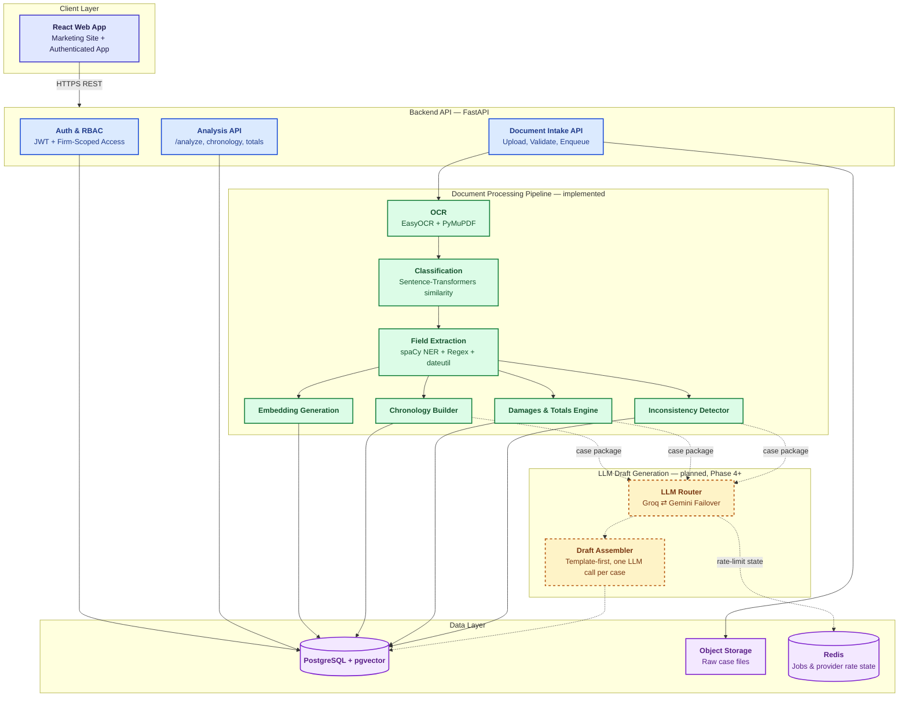

# Legal Doc Intelligence

**A production-grade documentation automation platform for law firms.** Full plan: [`PROJECT_PLAN_v2.md`](PROJECT_PLAN_v2.md).

---

## 1. Project Overview

Lawyers and paralegals routinely receive large, unorganized sets of case documents — medical records, bills, wage reports, contracts, correspondence, and court filings, whether digital or scanned. Building a usable case record from this material today means manually reading every file, extracting relevant facts and dates, cross-checking figures against supporting records, and assembling a written work product such as a demand letter or case chronology. That work is repetitive, time-consuming, and error-prone, even though it does not require legal judgment to perform the extraction and organization steps.

**Legal Doc Intelligence** ingests a case's raw document folder and produces the structured outputs a lawyer or paralegal currently builds by hand: classified document sets, chronological timelines, damages calculations, inconsistency flags, and first-draft demand letters or case summaries — with a level of engineering discipline (automated testing, environment separation, CI, firm-level data isolation) meant to support real production use rather than a fragile prototype.

Existing legal AI platforms (Harvey, Legora) target large enterprise firms with expensive, sales-led platforms. Mid-sized firms and solo practitioners are underserved — they lack the budget for those platforms, and most affordable alternatives are limited to plain document chat rather than structured analytical output. This project targets that gap.

## 2. Objectives

- **Reduce manual hours** lawyers and paralegals spend on document sorting, timeline building, and first-draft generation.
- **Provide real analytical value** beyond simple search or chat — damage calculation, deadline extraction, and inconsistency detection across documents.
- **Minimize LLM cost per case** by doing deterministic extraction and open-source embeddings *before* any model call, and invoking a large language model only once per case, at the final drafting step.
- **Enforce strict firm-level data isolation** at the database query layer, not just the API layer, so one firm can never see another firm's data — even from a coding mistake.
- **Follow production-grade engineering practice from the first commit** — automated tests, CI, environment separation, and observability — so the MVP can graduate into a real deployment without a rewrite.
- **Use only free and open-source technology** for this stage, so the system is buildable, testable, and demonstrable at zero infrastructure cost.

## 3. What We've Built So Far

| Phase | Status | Delivered |
|---|---|---|
| **0 — Project Setup** | ✅ Done | Repo scaffold, Docker Compose (Postgres+pgvector, Redis), typed env config, CI (lint + test), MkDocs site |
| **1 — Backend Foundation** | ✅ Done | FastAPI skeleton, full SQLAlchemy data model, Alembic migrations, JWT auth (access + refresh), role-based access control, firm-level isolation enforced at the query layer and proven by an automated test |
| **2 — Document Intake Pipeline** | ✅ Done | Multi-file/archive upload with validation and zip-slip protection, OCR (EasyOCR + PyMuPDF, with a per-page OCR fallback for scanned content), document classification via embedding similarity, background processing sharing the request's DB session |
| **3 — Extraction & Analysis Engine** | ✅ Done | Structured field extraction (spaCy NER **+** regex **+** dateutil, cross-validated and range-checked before anything is persisted), chronology assembly, deterministic damages/wage totals, rule-based inconsistency detection, all firm-scoped |
| **4 — LLM Router & Draft Generation** | 🚧 Planned | Groq/Gemini failover router, single consolidated per-case prompt, template-first draft assembly |
| **5 — Marketing Site** | 🚧 Planned | Public site to an enterprise visual/content standard |
| **6 — Authenticated App UI** | 🚧 Planned | Case dashboard, document viewer, chronology view, draft review/export |
| **7 — Testing & Demo Data** | 🚧 Planned | Real public-source demonstration case folder, full pipeline walkthrough |
| **8 — Observability & Docs** | 🚧 Planned | Structured logging/monitoring, generated API reference, user guide |

Every phase to date carries its own automated test suite (33 tests total as of Phase 3), and every backend service module is deterministic and independently testable — no phase has required a rewrite of a prior one.

## 4. How This Helps

- A paralegal uploads a folder of case documents instead of manually sorting them — OCR and classification happen automatically, including per-page fallback for scanned pages a text-layer scan alone would miss.
- Dates, billed amounts, wage figures, and parties are extracted **and validated** (not just pattern-matched) before they ever reach a chronology or a total, so the numbers a lawyer reviews are numbers the system has already sanity-checked.
- Damages and wage totals are computed **deterministically** — a spreadsheet-grade sum, not a language model's arithmetic — and inconsistencies (conflicting bills for the same date, suspicious gaps between medical records) are surfaced automatically instead of being found by accident during manual review.
- Because all of the above happens with open-source models and rule-based logic, **a large language model is never involved until the final drafting step** — keeping per-case cost predictable and small, and keeping the system fully functional even if an LLM provider is unavailable (a case still gets a template-based draft).
- Firm-level data isolation is enforced at the database query layer itself, not only checked at the API boundary — the kind of guarantee a law firm's own security review will actually ask for.

## 5. Solution Architecture

The diagram below shows the full intended end-to-end system: what's built today (solid, colored by layer) and what's planned next (dashed amber, Phase 4 onward).



**Legend:** 🟦 Client · 🔵 Backend API · 🟩 Document processing pipeline (implemented, Phases 2–3) · 🟨 dashed — LLM draft generation (planned, Phase 4) · 🟪 Data layer.

**End-to-end flow:**

1. A user (lawyer, paralegal, or firm admin) uploads a case's document folder through the **React app**, authenticated via **JWT** with role-based access control.
2. The **Document Intake API** validates each file (type, size, zip-slip protection for archives), stores the raw file in object storage, and enqueues background processing.
3. **OCR** runs only where needed — a per-page fallback for scanned content that has no extractable text layer, so digital-native documents are never needlessly OCR'd.
4. **Classification** assigns a category (medical record, bill, wage record, correspondence, contract, filing) by embedding similarity against fixed category prototypes — no LLM call.
5. **Field extraction** combines spaCy NER with a regex safety net (regex catches formats NER misses, especially after imperfect OCR), then validates every candidate date and amount with `dateutil`/`Decimal` parsing and a plausibility check — bad candidates are dropped, never silently stored.
6. Validated fields feed three deterministic engines: **chronology assembly**, **damages/wage totals**, and **rule-based inconsistency detection** — all case-scoped, all re-computable on demand, all firm-isolated.
7. *(Planned, Phase 4)* Once a case's chronology, totals, and flags are assembled, a single consolidated package is sent through the **LLM Router** — which fails over between Groq and Gemini using Redis-backed rate-limit state — for exactly one model call per case to produce the narrative draft.
8. The lawyer reviews and edits the draft in the app and exports to Word or PDF.

Every table in **PostgreSQL** (with the `pgvector` extension for embeddings) carries a `firm_id`, and every query is filtered by it at the query layer — the same guarantee proven by this project's firm-isolation test suite from Phase 1 onward.

## 6. Technology Stack

| Layer | Technology |
|---|---|
| Backend | FastAPI (Python, async, typed), SQLAlchemy, Alembic |
| Database | PostgreSQL + `pgvector` |
| Jobs / rate state | Redis (FastAPI `BackgroundTasks` for now; Celery when volume justifies it) |
| OCR | EasyOCR + PyMuPDF |
| Classification / embeddings | `sentence-transformers` (`all-MiniLM-L6-v2`) |
| Structured extraction | spaCy NER (`en_core_web_sm`) + regex + `python-dateutil` |
| Auth | OAuth2 password flow, JWT (access + refresh), `passlib`/`bcrypt` |
| LLM (planned) | Groq (`gpt-oss-20b`) primary, Gemini secondary, router-based failover |
| Containerization | Docker + Docker Compose |
| CI | GitHub Actions (lint + test on every change) |
| Docs | MkDocs (Material theme) + Mermaid diagrams |

## 7. Setup

1. Copy the environment template and fill in real values:
   ```
   cp .env.example .env
   ```
2. Start Postgres (with pgvector) and Redis:
   ```
   docker compose up -d db redis
   ```
3. Install backend dependencies and run migrations:
   ```
   cd backend
   uv sync
   uv run alembic upgrade head
   ```
4. Run the backend:
   ```
   uv run uvicorn app.main:app --reload
   ```
5. Run tests:
   ```
   uv run pytest
   ```

## 8. Repository Layout

See `PROJECT_PLAN_v2.md` Section 8 for the full repository structure rationale. Each backend package and frontend folder has its own `README.md` describing its purpose, inputs, and outputs; narrative and architecture-level documentation lives under `docs/` (see Section 8's documentation-placement policy).

## 9. Git Discipline

This repository has a single contributor. Before every commit and push, verify `git config user.name` / `git config user.email` and `git remote -v` match this repository's identity — see `PROJECT_PLAN_v2.md` Section 20.
