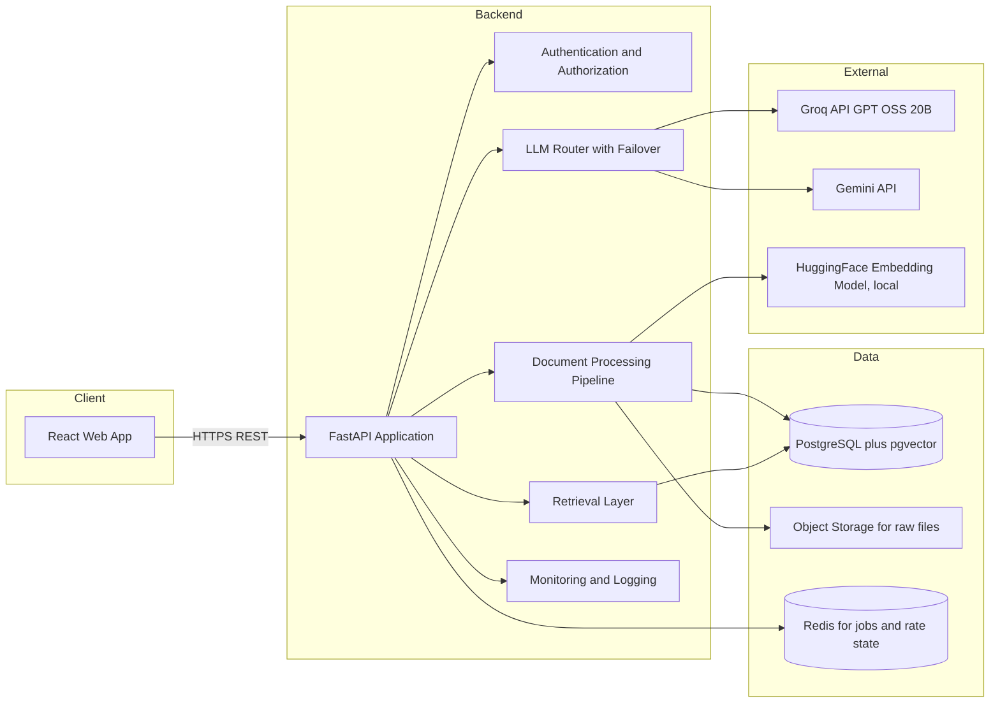

# Architecture

```mermaid
flowchart LR
    subgraph Client
        A[React Web App]
    end

    subgraph Backend
        B[FastAPI Application]
        C[Authentication and Authorization]
        D[Document Processing Pipeline]
        E[Retrieval Layer]
        F[LLM Router with Failover]
        M[Monitoring and Logging]
    end

    subgraph Data
        G[(PostgreSQL plus pgvector)]
        H[Object Storage for raw files]
        R[(Redis for jobs and rate state)]
    end

    subgraph External
        I[Groq API GPT OSS 20B]
        J[Gemini API]
        K[HuggingFace Embedding Model, local]
    end

    A -->|HTTPS REST| B
    B --> C
    B --> D
    D --> H
    D --> K
    D --> G
    B --> E
    E --> G
    B --> F
    F --> I
    F --> J
    B --> R
    B --> M
```

Full detail in `PROJECT_PLAN_v2.md` Sections 4–5, 10, 12, 17.
